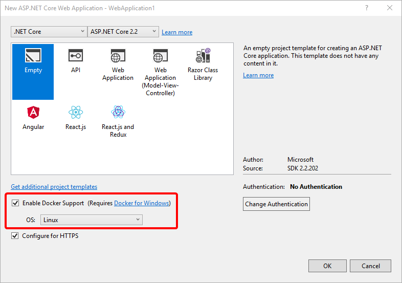
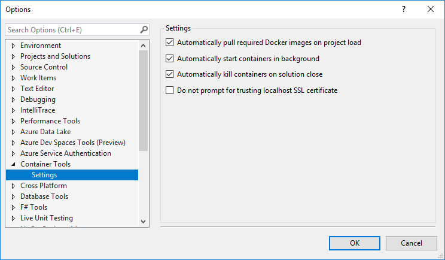

# Use Docker Tools in Visual Studio 2017 on Windows

The developer workflow when using the Docker Tools included in Visual Studio 2017 version 15.7 and later, is similar to using Visual Studio Code and Docker CLI (in fact, it's based on the same Docker CLI), but it's easier to get started, simplifies the process, and provides greater productivity for the build, run, and compose tasks. It can also run and debug your containers via the usual `F5` and `Ctrl+F5` keys from Visual Studio. You can even debug a whole solution if its containers are defined in the same `docker-compose.yml` file at the solution level.

## Configure your local environment

With the latest versions of Docker for Windows, it's easier than ever to develop Docker applications because the setup is straightforward, as explained in the following references.

> [!TIP]
> To learn more about installing Docker for Windows, go to (<https://docs.docker.com/docker-for-windows/>).

## Docker support in Visual Studio 2017

There are two levels of Docker support you can add to a project. In ASP.NET Core projects, you can just add a `Dockerfile` file to the project by enabling Docker support. The next level is container orchestration support, which adds a `Dockerfile` to the project (if it doesn't already exist) and a `docker-compose.yml` file at the solution level. Container orchestration support, via Docker Compose, is added by default in Visual Studio 2017 versions 15.0 to 15.7. Container orchestration support is an opt-in feature in Visual Studio 2017 versions 15.8 or later. Version 15.8 an later support Docker Compose and Service Fabric.

The **Add > Docker Support** and **Add > Container Orchestrator Support** commands are located on the right-click menu (or context menu) of the project node for an ASP.NET Core project in **Solution Explorer**, as shown in Figure 4-31:

**Figure 4-31**. Adding Docker support to a Visual Studio 2017 project

### Add Docker support

You can add Docker support to an existing ASP.NET Core project by selecting **Add** > **Docker Support** in **Solution Explorer**. You can also enable Docker support during project creation by selecting **Enable Docker Support** in the **New ASP.NET Core Web Application** dialog box that opens after you click **OK** in the **New Project** dialog box, as shown in Figure 4-32.

**Figure 4-32**. Enable Docker support during project creation in Visual Studio 2017

When you add or enable Docker support, Visual Studio adds a *Dockerfile* file to the project.

> [!NOTE]
> When you enable Docker Compose support during project creation for a ASP.NET project (.NET Framework, not a .NET Core project) as shown in Figure 4-33, container orchestration support is also added.

**Figure 4-33**. Enabling Docker Compose support for an ASP.NET project in Visual Studio 2017

### Add container orchestration support

When you want to compose a multi-container solution, add container orchestration support to your projects. This lets you run and debug a group of containers (a whole solution) at the same time if they're defined in the same *docker-compose.yml* file.

To add container orchestration support, right-click on the solution or project node in **Solution Explorer**, and choose **Add > Container Orchestration Support**. Then choose **Docker Compose** or **Service Fabric** to manage the containers.

After you add container orchestration support to your project, you see a Dockerfile added to the project and a **docker-compose** folder added to the solution in **Solution Explorer**, as shown in Figure 4-34:

**Figure 4-34**. Docker files in Solution Explorer in Visual Studio 2017

If *docker-compose.yml* already exists, Visual Studio just adds the required lines of configuration code to it.

## Configure Docker tools

From the main menu, choose **Tools > Options**, and expand **Container Tools > Settings**. The container tools settings appear.

**Figure 4-35**. Docker Tools Options

The following table might help you decide how to set these options.

| Name | Default Setting | Applies To | Description |
| -----|:---------------:|:----------:| ----------- |
| Automatically pull required Docker images on project load | On | Docker Compose | For increased performance when loading projects, Visual Studio will start a Docker pull operation in the background so that when you're ready to run your code, the image is already downloaded or in the process of downloading. If you're just loading projects and browsing code, you can turn this off to avoid downloading container images you don't need. |
| Automatically start containers in background | On | Docker Compose | Again for increased performance, Visual Studio creates a container with volume mounts ready for when you build and run your container. If you want to control when your container is created, turn this off. |
| Automatically kill containers on solution close | On | Docker Compose | Turn this off if you would like containers for your solution to continue to run after closing the solution or closing Visual Studio. |
| Do not prompt for trusting localhost SSL certificate | Off | ASP.NET Core 2.2 projects | If the localhost SSL certificate is not trusted, Visual Studio will prompt every time you run your project, unless this checkbox is checked. |

> [!WARNING]
> If the localhost SSL certificate is not trusted, and you check the box to suppress prompting, then HTTPS web requests might fail at runtime in your app or service. In that case, uncheck the **Do not prompt** checkbox, run your project, and indicate trust at the prompt.

> [!TIP]
> For further details on the services implementation and use of Visual Studio Tools for Docker, read the following articles:
>
>Debugging apps in a local Docker container: <https://docs.microsoft.com/azure/vs-azure-tools-docker-edit-and-refresh>
>
>Deploy an ASP.NET container to a container registry using Visual Studio: <https://docs.microsoft.com/azure/vs-azure-tools-docker-hosting-web-apps-in-docker>

>[!div class="step-by-step"]
>[Previous](docker-apps-inner-loop-workflow.md)
>[Next](set-up-windows-containers-with-powershell.md)
