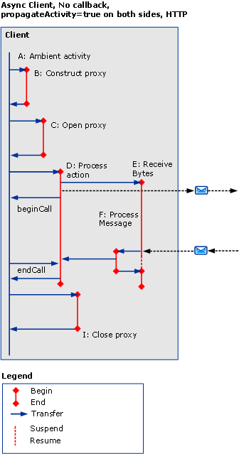
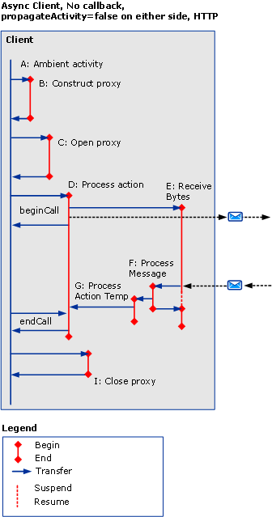
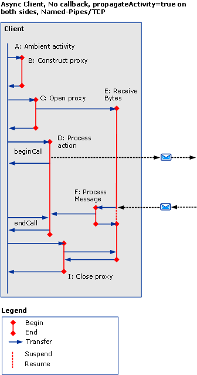
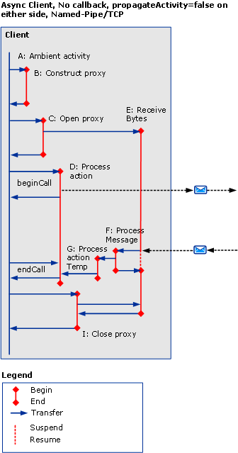
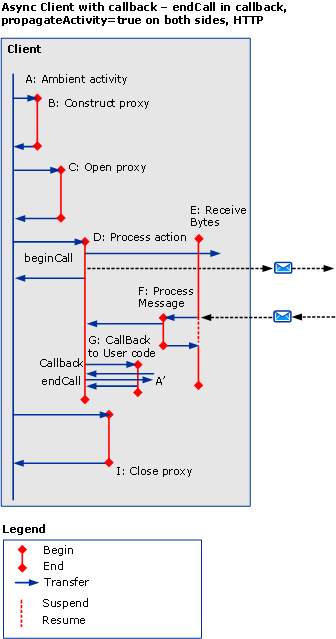
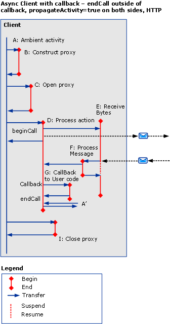
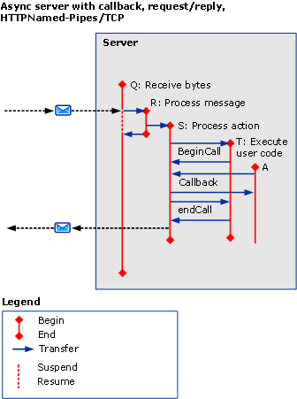

# Asynchronous Scenarios using HTTP, TCP, or Named-Pipe
This topic describes the activities and transfers for different asynchronous request/reply scenarios, with multithreaded requests using HTTP, TCP, or named pipe.  
  
## Asynchronous Request/Reply without Errors  
 This section describes the activities and transfers for an asynchronous request/reply scenario, with multithreaded clients.  
  
 The caller activity terminates when `beginCall` returns, and `endCall` returns. If a callback is called, the callback returns.  
  
 The called activity terminates when `beginCall` returns, `endCall` returns, or when the callback returns if it was called from that activity.  
  
### Asynchronous Client without Callback  
  
#### Propagation is Enabled on Both Sides, using HTTP  
    
  
 If `propagateActivity=true`, ProcessMessage indicates which ProcessAction activity to transfer to.  
  
 For HTTP-based scenarios, ReceiveBytes is invoked on the first message to send, and exists for the lifetime of the request.  
  
#### Propagation is Disabled on Either Sides, using HTTP  
 If `propagateActivity=false` on either side, ProcessMessage does not indicate which ProcessAction activity to transfer to. Therefore, a new temporary ProcessAction activity with a new ID is invoked. When the asynchronous response is matched to the request in ServiceModel code, the Activity ID can be retrieved from the local context. The actual ProcessAction activity can be transferred to with that ID.  
  
   
    
 For HTTP-based scenarios, ReceiveBytes is invoked on the first message to send, and exists for the lifetime of the request.  
  
 A Process Action activity is created on an asynchronous client when `propagateActivity=false` at the caller or callee, and when the response message does not include an Action header.  
  
#### Propagation is Enabled on Both Sides, using TCP or Named Pipe  
   
  
 For a Named-Pipe or TCP-based scenario, ReceiveBytes is invoked when the client is opened, and exists for the lifetime of the connection.  
  
 Similar to the first image, if `propagateActivity=true`, ProcessMessage indicates which ProcessAction activity to transfer to.  
  
#### Propagation is Disabled on Either Sides, using TCP or Named Pipe  
 For a Named-Pipe or TCP-based scenario, ReceiveBytes is invoked when the client is opened, and exists for the lifetime of the connection.  
  
 Similar to the second image, if `propagateActivity=false` on either side, ProcessMessage does not indicate which ProcessAction activity to transfer to. Therefore, a new temporary ProcessAction activity with a new ID is invoked. When the asynchronous response is matched to the request in ServiceModel code, the Activity ID can be retrieved from the local context. The actual ProcessAction activity can be transferred to with that ID.  
  
   
    
### Asynchronous client with Callback  
 This scenario adds activities G and A’, for the callback and `endCall`, and their transfers in/out.  
  
 This section only demonstrates using HTTP with `propagateActivity`=`true`. However, the additional activities and transfers also apply to the other cases (that is, `propagateActivity`=`false`, using TCP or Named-Pipe).  
  
 The callback creates a new activity (G) when the client calls user code to notify that results are ready. User code then calls `endCall` within the callback (as shown in Figure 5) or outside the callback (Figure 6). Because it is not known which user activity `endCall` is being called from, this activity is labeled `A’`. It is possible that A’ can be identical to or different from A.  
  
   
    
   
    
### Asynchronous Server with Callback  
   
    
 The channel stack calls back the client on Message Receive: traces for this processing are emitted in the ProcessRequest activity itself.  
  
## Asynchronous Request/Reply with Errors  
 Fault message errors are received during `endCall`. Otherwise, activities and transfers are similar to previous scenarios.  
  
## Asynchronous One-Way with or without Errors  
 No response or fault is returned to the client.
