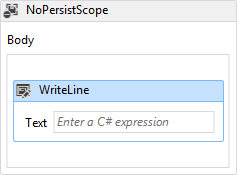
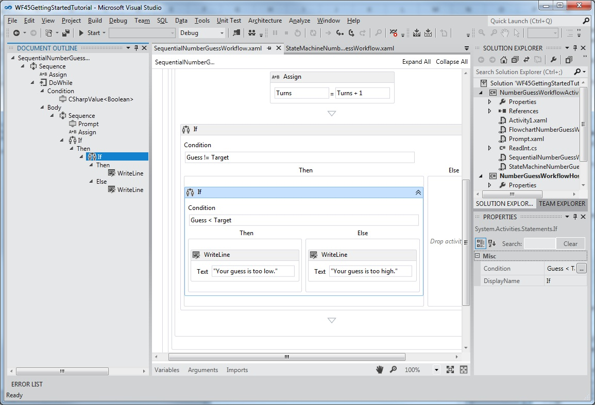
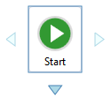
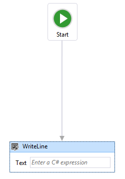
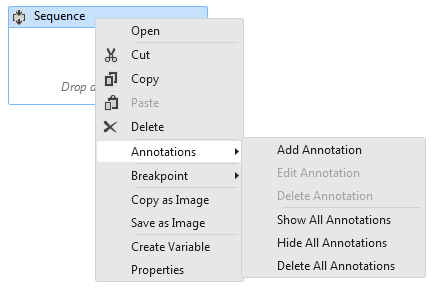

# What's New in Windows Workflow Foundation in .NET 4.5

Windows Workflow Foundation (WF) in .NET Framework 4.5 introduces many new features, such as new activities, designer capabilities, and workflow development models. Many, but not all, of the new workflow features introduced in .NET Framework 4.5 are supported in the re-hosted workflow designer. For more information about the new features that are supported, see [Support for New Workflow Foundation 4.5 Features in the Rehosted Workflow Designer](wf-features-in-the-rehosted-workflow-designer.md). For more information about migrating .NET 3.0 and .NET 3.5 workflow applications to use the latest version, see [Migration Guidance](migration-guidance.md). This topic provides an overview of the new workflow features introduced in .NET Framework 4.5.

> [!WARNING]
> The new Windows Workflow Foundation features introduced in .NET Framework 4.5 are not available for projects that target previous versions of the framework. If a project that targets .NET Framework 4.5 is re-targeted to a previous version of the framework, several issues can occur.
>
> - C# expressions will be replaced in the designer with the message **Value was set in XAML**.
> - Many build errors will occur, including the following error.
>
> **The file format is not compatible with current targeting framework. To convert the file format, please explicitly save the file. This error message will go away after you save the file and reopen the designer.**

## <a name="BKMK_Versioning"></a> Workflow Versioning

.NET Framework 4.5 introduced several new versioning features based around the new <xref:System.Activities.WorkflowIdentity> class. <xref:System.Activities.WorkflowIdentity> provides workflow application authors a mechanism for mapping a persisted workflow instance with its definition.

- Developers using <xref:System.Activities.WorkflowApplication> hosting can use <xref:System.Activities.WorkflowIdentity> to enable hosting multiple versions of a workflow side-by-side. Persisted workflow instances can be loaded using the new <xref:System.Activities.WorkflowApplicationInstance> class, and then the <xref:System.Activities.WorkflowApplicationInstance.DefinitionIdentity%2A> can be used by the host to provide the correct version of the workflow definition when instantiating the <xref:System.Activities.WorkflowApplication>. For more information, see [Using WorkflowIdentity and Versioning](using-workflowidentity-and-versioning.md) and [How to: Host Multiple Versions of a Workflow Side-by-Side](how-to-host-multiple-versions-of-a-workflow-side-by-side.md).

- <xref:System.ServiceModel.WorkflowServiceHost> is now a multi-version host. When a new version of a workflow service is deployed, new instances are created using the new service, but existing instances complete using the previous version. For more information, see [Side by Side Versioning in WorkflowServiceHost](../wcf/feature-details/side-by-side-versioning-in-workflowservicehost.md).

- Dynamic update is introduced which provides a mechanism for updating the definition of a persisted workflow instance. For more information, see [Dynamic Update](dynamic-update.md) and [How to: Update the Definition of a Running Workflow Instance](how-to-update-the-definition-of-a-running-workflow-instance.md).

- A SqlWorkflowInstanceStoreSchemaUpgrade.sql database script is provided to upgrade persistence databases created using the [!INCLUDE[netfx40_short](../../../includes/netfx40-short-md.md)] database scripts. This script updates [!INCLUDE[netfx40_short](../../../includes/netfx40-short-md.md)] persistence databases to support the new versioning capabilities introduced in .NET Framework 4.5. The persisted workflow instances in the database are given default versioning values, and can participate in side-by-side execution and dynamic update. For more information, see [Upgrading .NET Framework 4 Persistence Databases to Support Workflow Versioning](using-workflowidentity-and-versioning.md#UpdatingWF4PersistenceDatabases).

## <a name="BKMK_NewActivities"></a> Activities

The built-in activity library contains new activities and new features for existing activities.

### <a name="BKMK_NoPersistScope"></a> NoPersist Scope

<xref:System.Activities.Statements.NoPersistScope> is a new container activity that prevents a workflow from being persisted when the NoPersistScope’s child activities are executing. This is useful in scenarios where it is not appropriate for the workflow to be persisted, such as when the workflow is using machine-specific resources such as file handles, or during database transactions. Previously, to prevent persistence from occurring during an activity's execution, a custom <xref:System.Activities.NativeActivity> that used a <xref:System.Activities.NoPersistHandle> was required.

### <a name="BKMK_NewFlowchartCapabilities"></a> New Flowchart Capabilities

Flowcharts are updated for .NET Framework 4.5 and have the following new capabilities:

- The `DisplayName` property of a <xref:System.Activities.Statements.FlowSwitch%601> or <xref:System.Activities.Statements.FlowDecision> activity is editable. This will let the activity designer show more information about the activity's purpose.

- Flowcharts have a new property called <xref:System.Activities.Statements.Flowchart.ValidateUnconnectedNodes%2A>; the default for this property is `False`. If this property is set to `True`, then unconnected flowchart nodes will produce validation errors.

## Support for Partial Trust

Workflows in [!INCLUDE[netfx40_long](../../../includes/netfx40-long-md.md)] required a fully trusted application domain. In .NET Framework 4.5, workflows can operate in a partial trust environment. In a partial trust environment, third-party components can be used without granting them full access to the resources of the host. Some concerns about running workflows in partial trust are as follows:

1. Using legacy components (including Rules) contained in the <xref:System.Activities.Statements.Interop> activity is not supported under partial trust.

2. Running workflows in partial trust in <xref:System.ServiceModel.WorkflowServiceHost> is not supported.

3. Persisting exceptions in a partial-trust scenario is a potential security threat. To disable persisting of exceptions, an extension of type <xref:System.Activities.ExceptionPersistenceExtension> must be added to the project in order to opt out of persisting exceptions. The following code example demonstrates how to implement this type.

    ```csharp
    public class ExceptionPersistenceExtension
    {
        public ExceptionPersistenceExtension()
        {
            this.PersistExceptions = false;
        }
        public bool PersistExceptions { get; set; }
    }
    ```

     If exceptions are not to be serialized, ensure that exceptions are used within a <xref:System.Activities.Statements.NoPersistScope>.

4. Activity authors should override <xref:System.Activities.Activity.CacheMetadata%2A> to avoid having the workflow runtime automatically execute reflection against the type. Arguments and child activities must be non-null, and <xref:System.Activities.ActivityMetadata.Bind%2A> must be called explicitly. For more information on overriding <xref:System.Activities.Activity.CacheMetadata%2A>, see [Exposing data with CacheMetadata](exposing-data-with-cachemetadata.md). Also, instances of arguments that are of a type that is `internal` or **private** must be explicitly created in  <xref:System.Activities.Activity.CacheMetadata%2A> to avoid being created by reflection.

5. Types will not use <xref:System.Runtime.Serialization.ISerializable> or <xref:System.SerializableAttribute> for serialization; types that are to be serialized must support <xref:System.Runtime.Serialization.DataContractSerializer>.

6. Expressions that use <xref:System.Activities.Expressions.LambdaValue%601> require <xref:System.Security.Permissions.ReflectionPermissionAttribute.RestrictedMemberAccess%2A>, and thus will not work under partial trust. Workflows that use <xref:System.Activities.Expressions.LambdaValue%601> should replace those expressions with activities that derive from <xref:System.Activities.CodeActivity%601>. .

7. Expressions cannot be compiled using <xref:System.Activities.XamlIntegration.TextExpressionCompiler> or the Visual Basic hosted compiler in partial trust, but previously compiled expressions can be run.

8. A single assembly that uses [Level 2 Transparency](https://aka.ms/Level2Transparency) cannot be used in [!INCLUDE[netfx40_short](../../../includes/netfx40-short-md.md)], [!INCLUDE[netfx_current_short](../../../includes/netfx-current-short-md.md)] in full trust, and [!INCLUDE[netfx_current_short](../../../includes/netfx-current-short-md.md)] in partial trust.

## <a name="BKMK_NewDesignerCapabilites"></a> New Designer Capabilities

### <a name="BKMK_DesignerSearch"></a> Designer Search

To make larger workflows more manageable, workflows can now be searched by keyword. This feature is only available in Visual Studio; this feature is not available in a rehosted designer. There are two kinds of searches available:

- Quick Find, initiated with either **Ctrl+F** or **Edit**, **Find and Replace**, **Quick Find**.

- Find in Files, initiated with either **Ctrl+Shift+F** or **Edit**, **Find and Replace**, **Find in Files**.

Note that Replace is not supported.

#### <a name="BKMK_QuickFind"></a> Quick Find

Keywords searched in workflows will match the following designer items:

- Properties of <xref:System.Activities.Activity> objects, <xref:System.Activities.Statements.FlowNode> objects, <xref:System.Activities.Statements.State> objects, <xref:System.Activities.Statements.Transition> objects, and other custom flow-control items.

- Variables

- Arguments

- Expressions

Quick Find is performed on the designer's <xref:System.Activities.Presentation.Model.ModelItem> tree. Quick Find will not locate namespaces imported in the workflow definition.

#### <a name="BKMK_FindInFiles"></a> Find in Files

Keywords searched in workflows will match the actual content of the workflow files. The search results will be shown in Visual Studio Find Results view pane. Double-clicking the result item will navigate to the activity which contains the match in workflow designer.

### <a name="BKMK_VariableDeleteContextMenu"></a> Delete context menu item in variable and argument designer

In [!INCLUDE[netfx40_short](../../../includes/netfx40-short-md.md)], variables and arguments could only be deleted in the designer using the keyboard. Starting with .NET Framework 4.5, variables and arguments can be deleted using the context menu.

The following screenshot shows the variable and argument designer context menu.


### <a name="BKMK_AutoSurround"></a> Auto-surround with Sequence

Since a workflow or certain container activities (such as <xref:System.Activities.Statements.NoPersistScope>) can only contain a single body activity, adding a second activity required the developer to delete the first activity, add a <xref:System.Activities.Statements.Sequence> activity, and then add both activities to the sequence activity. Starting with .NET Framework 4.5, when adding a second activity to the designer surface, a `Sequence` activity will be automatically created to wrap both activities.

The following screenshot shows a `WriteLine` activity in the `Body` of a `NoPersistScope`.



The following screenshot shows the automatically created `Sequence` activity in the `Body` when a second `WriteLine` is dropped below the first.


### <a name="BKMK_PanMode"></a> Pan Mode

To more easily navigate a large workflow in the designer, pan mode can be enabled, allowing the developer to click and drag to move the visible portion of the workflow, rather than needing to use the scroll bars. The button to activate pan mode is in the lower right corner of the designer.

The following screenshot shows the pan button which is located at the bottom right corner of the workflow designer.


The middle mouse button or space bar can also be used to pan the workflow designer.

### <a name="BKMK_MultiSelect"></a> Multi-select

Multiple activities can be selected at one time, either by dragging a rectangle around them (when pan mode is not enabled), or by holding down Ctrl and click the desired activities one by one.

Multiple activity selections can also be dragged and dropped within the designer, and can also be interacted with using the context menu.

### <a name="BKMK_DocumentOutline"></a> Outline view of workflow items

In order to make hierarchical workflows easier to navigate, components of a workflow are shown in a tree-style outline view. The outline view is displayed in the **Document Outline** view. To open this view, from the top menu, select **View**, **Other Windows**, **Document Outline**, or press Ctrl W,U. Clicking on a node in outline view will navigate to the corresponding activity in the workflow designer, and the outline view will be updated to show activities that are selected in the designer.

The following screenshot of the completed workflow from the [Getting Started Tutorial](getting-started-tutorial.md) shows the outline view with a sequential workflow.



### <a name="BKMK_CSharpExpressions"></a> C# Expressions

Prior to .NET Framework 4.5, all expressions in workflows could only be written in Visual Basic. In .NET Framework 4.5, Visual Basic expressions are only used for projects created using Visual Basic. Visual C# projects now use C# for expressions. A fully functional C# expression editor is provided which capabilities such as grammar highlighting and intellisense. C# workflow projects created in previous versions that use Visual Basic expressions will continue to work.

C# expressions are validated at design-time. Errors in C# expressions will be marked with a red wavy underline.

For more information about C# expressions, see [C# Expressions](csharp-expressions.md).

### <a name="BKMK_Visibility"></a> More control of visibility of shell bar and header items

In a rehosted designer, some of the standard UI controls may not have meaning for a given workflow, and may be turned off. In [!INCLUDE[netfx40_short](../../../includes/netfx40-short-md.md)], this customization is only supported by the shell bar at the bottom of the designer. In .NET Framework 4.5, the visibility of shell header items at the top of the designer can be adjusted by setting <xref:System.Activities.Presentation.View.DesignerView.WorkflowShellHeaderItemsVisibility%2A> with the appropriate <xref:System.Activities.Presentation.View.ShellHeaderItemsVisibility> value.

### <a name="BKMK_AutoConnect"></a> Auto-connect and auto-insert in Flowchart and State Machine workflows

In [!INCLUDE[netfx40_short](../../../includes/netfx40-short-md.md)], connections between nodes in a Flowchart workflow had to be added manually. In .NET Framework 4.5, Flowchart and State Machine nodes have auto-connect points that become visible when an activity is dragged from the toolbox onto the designer surface. Dropping an activity on one of these points automatically adds the activity along with the necessary connection.

The following screenshot shows the attachment points that become visible when an activity is dragged from the toolbox.



Activities can also be dragged onto connections between flowchart nodes and states to auto-insert the node between two other nodes. The following screenshot shows the highlighted connecting line where activities can be dragged from the toolbox and dropped.



### <a name="BKMK_Annotations"></a> Designer Annotations

To facilitate developing larger workflows, the designer now supports adding annotations to help keep track of the design process. Annotation can be added to activities, states, flowchart nodes, variables and arguments. The following screenshot shows the context menu used to add annotations to the designer.



### Debugging states

In [!INCLUDE[netfx40_short](../../../includes/netfx40-short-md.md)], non-activity elements could not support debug breakpoints since they were not units of execution. This release provides a mechanism for adding breakpoints to <xref:System.Activities.Statements.State> objects. When a breakpoint is set on a <xref:System.Activities.Statements.State>, execution will break when the state is transitioned to, before its entry activities or triggers are scheduled.

### <a name="BKMK_ActivityDelegates"></a> Define and consume ActivityDelegate objects in the designer

Activities in [!INCLUDE[netfx40_short](../../../includes/netfx40-short-md.md)] used <xref:System.Activities.ActivityDelegate> objects to expose execution points where other parts of the workflow could interact with a workflow's execution, but using these execution points usually required a fair amount of code. In this release, developers can define and consume activity delegates using the workflow designer. For more information, see [How to: Define and consume activity delegates in the Workflow Designer](/visualstudio/workflow-designer/how-to-define-and-consume-activity-delegates-in-the-workflow-designer).

### <a name="BKMK_BuildTimeValidation"></a> Build-time validation

In [!INCLUDE[netfx40_short](../../../includes/netfx40-short-md.md)], workflow validation errors weren’t counted as build errors during the build of a workflow project. This meant that building a workflow project could succeed even when there were workflow validation errors. In .NET Framework 4.5, workflow validation errors cause the build to fail.

### <a name="BKMK_DesignTimeValidation"></a> Design-time background validation

In [!INCLUDE[netfx40_short](../../../includes/netfx40-short-md.md)], workflows were validated as a foreground process, which could potentially block the UI during complex or time-consuming validation processes. Workflow validation now takes place on a background thread, so that the UI is not blocked.

### <a name="BKMK_ViewState"></a> View state located in a separate location in XAML files

In [!INCLUDE[netfx40_short](../../../includes/netfx40-short-md.md)], the view state information for a workflow is stored across the XAML file in many different locations. This is inconvenient for developers who want to read XAML directly, or write code to remove the view state information. In .NET Framework 4.5, the view state information in the XAML file is serialized as a separate element in the XAML file. Developers can easily locate and edit the view state information of an activity, or remove the view state altogether.

### <a name="BKMK_ExpressionExtensibility"></a> Expression extensibility

In .NET Framework 4.5, we provide a way for developers to create their own expression and expression authoring experience that can be plugged into the workflow designer.

### <a name="BKMK_BackwardCompatRehostedDesigner"></a> Opt-in for Workflow 4.5 features in rehosted designer

To preserve backward compatibility, some new features included in .NET Framework 4.5 are not enabled by default in the rehosted designer. This is to ensure that existing applications that use the rehosted designer are not broken by updating to the latest version. To enable new features in the rehosted designer, either set <xref:System.Activities.Presentation.DesignerConfigurationService.TargetFrameworkName%2A> to ".NET Framework 4.5", or set individual members of <xref:System.Activities.Presentation.DesignerConfigurationService> to enable individual features.

## <a name="BKMK_NewWFModels"></a> New Workflow Development Models

In addition to flowchart and sequential workflow development models, this release includes State Machine workflows, and contract-first workflow services.

### <a name="BKMK_StateMachine"></a> State machine workflows

State machine workflows were introduced as part of the .NET Framework 4, version 4.0.1 in the [Microsoft .NET Framework 4 Platform Update 1](https://go.microsoft.com/fwlink/?LinkID=215092). This update included several new classes and activities which allowed developers to create state machine workflows. These classes and activities have been updated for .NET Framework 4.5. Updates include:

1. The ability to set breakpoints on states

2. The ability to copy and paste transitions in the workflow designer

3. Designer support for shared trigger transition creation

4. Activities used to create State Machine workflows, including: <xref:System.Activities.Statements.StateMachine>, <xref:System.Activities.Statements.State>, and <xref:System.Activities.Statements.Transition>

The following screenshot shows the completed state machine workflow from the [Getting Started Tutorial](getting-started-tutorial.md) step [How to: Create a State Machine Workflow](how-to-create-a-state-machine-workflow.md).


For more information on creating state machine workflows, see [State Machine Workflows](state-machine-workflows.md).

### <a name="BKMK_ContractFirst"></a> Contract-first workflow development

The contract-first workflow development tool allows the developer to design a contract in code first, then, with a few clicks in Visual Studio, automatically generate an activity template in the toolbox representing each operation. These activities are then used to create a workflow that implements the operations defined by the contract. The workflow designer will validate the workflow service to ensure that these operations are implemented and the signature of the workflow matches the contract signature. The developer can also associate a workflow service with a collection of implemented contracts. For more information on contract-first workflow service development, see [How to: Create a workflow service that consumes an existing service contract](how-to-create-a-workflow-service-that-consumes-an-existing-service-contract.md).
